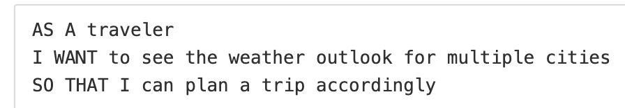
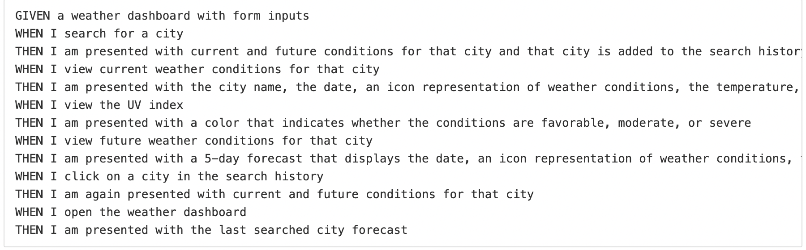
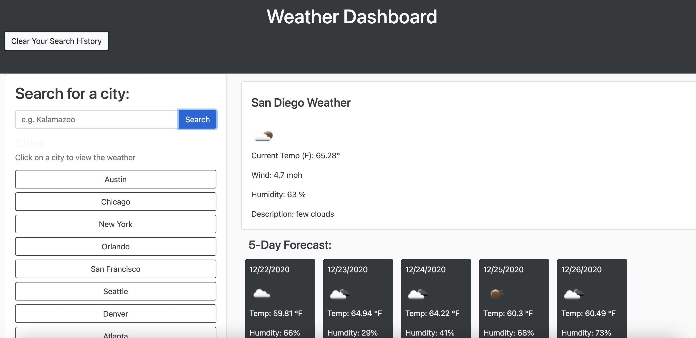

# weatherDashboard
# Shane O'Connell
# https://shaneocon.github.io/weatherDashboard/
## Weather Dashboard
## 12-21-2020

## User Story

## Acceptance Criteria

## Finished App

### Pseudocode

- City Search (Both __input__ and __button__)
- search history
- Current weather conditions load with city name
- current:
    - Weather Icon
    - Temp
    - Humidity
    - Wind speed

- 5 Day Forecast:
    - Bootstrap Cards
    - __Each Card__:
        - date
        - weather icon
        - temp
        - humidity

- City results should load with each search and button click.  

## Description

This was a very tough assignment but I think it will be a useful one to return back to throughout the rest of the class.  Once again, I learned a lot, but the activities done in class helped me really understand the concepts of these units(5 & 6).  

